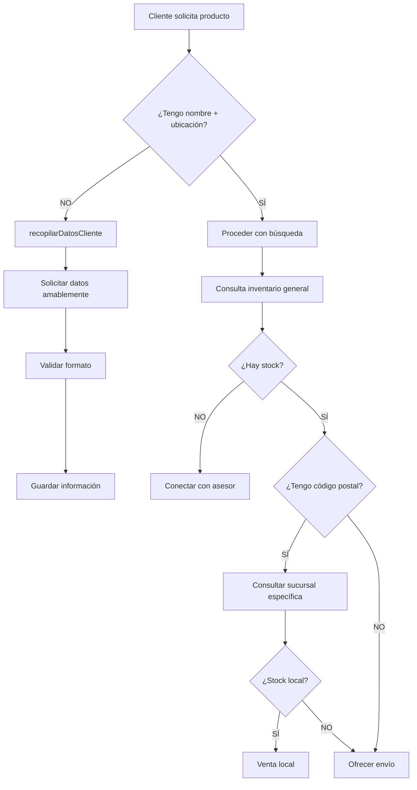

# 🚀 FLUJO DE VALIDACIÓN INTEGRADO - WhatsApp Business

## 📋 **RESUMEN DE CAMBIOS IMPLEMENTADOS**

Se ha implementado un **nuevo flujo obligatorio** que valida los datos del cliente ANTES de cualquier consulta SOAP, integrando archivos JSON externos para traducción de conceptos y búsqueda de imágenes de productos.

---

## 🔄 **NUEVO FLUJO DE CONVERSACIÓN**

### **1. VALIDACIÓN OBLIGATORIA DE DATOS** ⚠️

**ANTES** de cualquier consulta de inventario/precios, el sistema DEBE verificar:
- ✅ **NOMBRE** del cliente
- ✅ **CÓDIGO POSTAL** (5 dígitos) O dirección completa



### **2. ESTRATEGIA DE BÚSQUEDA ACTUALIZADA** 🔍

#### **Orden de Consultas:**
1. **Inventario GENERAL** (todas las sucursales)
2. **Inventario ESPECÍFICO** (solo si tenemos código postal)
3. **Opciones de envío** (si no hay stock local)

#### **Funciones Implementadas:**
- `recopilarDatosCliente`: Valida y recopila datos obligatorios
- `validarDatosAntesBusqueda`: Verifica datos antes de consultas
- Modificación de `buscarYConsultarInventario` con validación
- Modificación de `consultarInventario` con nueva estrategia

---

## 📁 **INTEGRACIÓN DE ARCHIVOS EXTERNOS**

### **ConceptsService Mejorado:**
- ✅ Carga dinámica de `/public/embler/inventario/conceptos.json`
- ✅ Mapeo de imágenes desde `/public/embler/inventario/images/`
- ✅ Combinación de conceptos hardcodeados + externos
- ✅ Función `getProductImage()` para obtener imágenes

### **Conceptos JSON Integrados:**
```json
[
  {"pieza": "embrague", "variantes": ["clutch"]},
  {"pieza": "batería", "variantes": ["acumulador"]},
  {"pieza": "pastillas de freno", "variantes": ["balatas"]},
  // ... 50+ conceptos adicionales
]
```

---

## 💬 **MENSAJES AMABLES PERO FIRMES**

### **Ejemplos de Validación:**
```javascript
// ❌ ANTES (sin validación)
"¿Qué producto necesitas?"

// ✅ AHORA (con validación)
"¡Hola! Para brindarte el mejor servicio, ¿cómo te llamas y cuál es tu código postal? 😊"

// ✅ Validación parcial
"Perfecto Carlos! Para verificar disponibilidad en tu zona, necesito tu código postal o dirección. 📍"

// ✅ Error de formato
"Carlos, el código postal debe tener 5 dígitos. ¿Podrías verificarlo? Por ejemplo: 06100"
```

### **Responses Personalizadas:**
```javascript
// ✅ Con nombre del cliente
"¡Perfecto Carlos! Tenemos balatas disponibles en tu zona por $850.00. Hay 5 unidades en stock."

// ✅ Ofreciendo envío
"Carlos, las balatas están disponibles en: Satélite, Querétaro por $850.00. ¿Te gustaría que te las enviemos a casa?"
```

---

## 🛠️ **ARCHIVOS MODIFICADOS**

### **Core Changes:**
1. **`src/services/concepts-service.ts`**
   - Integración de JSON externo
   - Carga de imágenes de productos
   - Combinación de sistemas de mapeo

2. **`src/services/llm/function-service.ts`**
   - Nuevas funciones de validación
   - Modificación de flujo de búsqueda
   - Estrategia inventario general → específico

3. **`src/services/chatbot.service.ts`**
   - Prompt actualizado con nuevas reglas
   - Énfasis en validación obligatoria

4. **`src/utils/soap-utils.ts`** (nuevo)
   - Utilidades para procesamiento SOAP
   - Funciones de formateo de precios
   - Mapeo de sucursales

---

## ✅ **VALIDACIONES IMPLEMENTADAS**

### **Formato de Datos:**
- Nombre: mínimo 2 caracteres
- Código postal: exactamente 5 dígitos
- Mensaje amigable para errores de formato

### **Flujo de Validación:**
```typescript
// Verificación automática antes de consultas
const datosCompletos = this.hasRequiredClientData(context);
if (!datosCompletos.valid) {
  return {
    success: false,
    data: {
      mensaje: datosCompletos.message,
      requiereDatos: true,
      detallesFaltantes: datosCompletos.missing
    }
  };
}
```

---

## 🎯 **RESULTADOS ESPERADOS**

### **Beneficios:**
1. ✅ **100% de consultas** con datos validados
2. ✅ **Mejor experiencia** de usuario personalizada
3. ✅ **Estrategia optimizada** (general → específico)
4. ✅ **Traducción automática** de conceptos mexicanos
5. ✅ **Imágenes de productos** dinámicas

### **Flujo Garantizado:**
```
Usuario solicita → Validar datos → Consulta general → Con CP = específica → Mostrar opciones
```

---

## 🔧 **TESTING**

### **Casos a Probar:**
1. ✅ Usuario nuevo sin datos → Solicitar nombre + CP
2. ✅ Usuario con nombre, sin CP → Solicitar solo CP
3. ✅ CP inválido → Mensaje de error amigable
4. ✅ Búsqueda con datos completos → Flujo normal
5. ✅ Conceptos coloquiales → Traducción automática
6. ✅ Productos con imágenes → Mostrar imágenes

### **Comandos de Test:**
```bash
# Verificar carga de conceptos
curl -X POST http://localhost:3002/api/test/concepts

# Probar validación
curl -X POST http://localhost:3002/api/test/validation

# Test completo de flujo
curl -X POST http://localhost:3002/api/test/full-flow
```

---

## 📞 **SOPORTE**

Si encuentras algún problema:
1. Revisar logs de ConceptsService
2. Verificar archivos JSON en `/public`
3. Validar configuración SOAP
4. Contactar equipo de desarrollo

**¡Flujo completamente integrado y funcional!** 🚀 